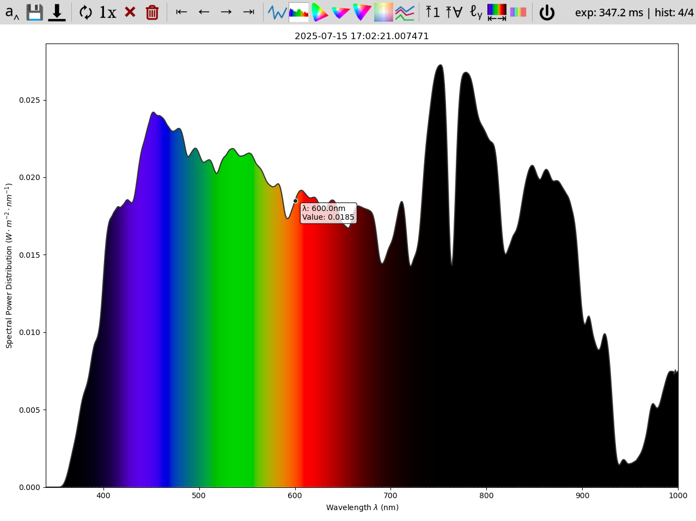

# tobes-ui: Torch Bearer Spectrometer UI

This is a UI for [Torch Bearer](https://www.torchbearer.tech/)
Spectrometer (`Y21B7W10034CCPD`) that is available on Amazon
and AliExpress ([TB Store](https://www.aliexpress.com/store/1104401209)).

Forked from [ZoidTechnology/Torch-Bearer-Tools](https://github.com/ZoidTechnology/Torch-Bearer-Tools)[^1]
and improved (beyond recognition?).

## Requirements

- Python 3.10
- `pip install colour-science matplotlib pyserial`

## Usage

```
$ python3 main.py -h
usage: main.py [-h] [-e EXPOSURE] [-q | -t GRAPH_TYPE] [-o] [-f FILE_TEMPLATE] input_device

TorchBearer spectrometer tool

positional arguments:
  input_device          Spectrometer device (/dev/ttyUSB0)

options:
  -h, --help            show this help message and exit
  -e EXPOSURE, --exposure EXPOSURE
                        Exposure time in milliseconds (100..5000) or 'auto' (default: auto)
  -q, --quick-graph     Enable quick (LINE) graph mode
  -t GRAPH_TYPE, --graph_type GRAPH_TYPE
                        Graph type (LINE, SPECTRUM, CIE1931, CIE1960UCS, CIE1976UCS) (default SPECTRUM)
  -o, --oneshot         One shot mode (single good capture)
  -f FILE_TEMPLATE, --file_template FILE_TEMPLATE
                        File template (without .ext) for data export (default:
                        spectrum-{timestamp_full}{graph_type})
```

My typical use is:

``` sh
python3 main.py /dev/ttyUSB0 -e auto -o
```

which gives one-shot spectrum on auto exposure (from `/dev/ttyUSB0`):



Or, if you prefer, [screenshot of the CIE1976UCS locus](pictures/oneshot-cie1976ucs.png).

There are several icons on the toolbar:

- : Saves rendered graph as png (key: `S`)
- : Save raw data as json (key: `D`)
- : Keep refreshing data (key: `R`)
- : One good acquisition (key: `1` or `O`)
- : Line graph (key: `Q`, `L`)
- : Spectrum graph _(slow to draw)_ (key: `C`)
- : CIE1931 locus graph (key: `3`)
- : CIE1960UCS locus graph (key: `6`)
- : CIE1976UCS locus graph (key: `7`)
- : Quit the app (key: `Esc`)

## Exported data

Sample exported data:

``` json
{
    "status": "normal",
    "exposure": "automatic",
    "time": 329.1,
    "spd": {
        "340": 0.0,
        "341": 0.0,
        "...": "......",
        "595": 0.013011,
        "596": 0.013095,
        "597": 0.013176,
        "598": 0.013251,
        "599": 0.013318,
        "600": 0.013385,
        "601": 0.01345,
        "602": 0.013515,
        "603": 0.013575,
        "604": 0.013621,
        "605": 0.013648,
        "...": "......",
        "995": 0.005143,
        "996": 0.005075,
        "997": 0.005119,
        "998": 0.004982,
        "999": 0.004944,
        "1000": 0.004859
    },
    "wavelength_range": [
        340,
        1000
    ],
    "spd_raw": [
        0.0,
        0.0,
        "......",
        0.013011,
        0.013095,
        0.013176,
        0.013251,
        0.013318,
        0.013385,
        0.01345,
        0.013515,
        0.013575,
        0.013621,
        0.013648,
        "......",
        0.005143,
        0.005075,
        0.005119,
        0.004982,
        0.004944,
        0.004859
    ],
    "ts": 1751704901.025932
}
```

## License

GPLv3

[^1]: Discussed in the [Software Hacks Unlock Cheap
Spectrometer](https://hackaday.com/2025/03/31/software-hacks-unlock-cheap-spectrometer/)
article.
